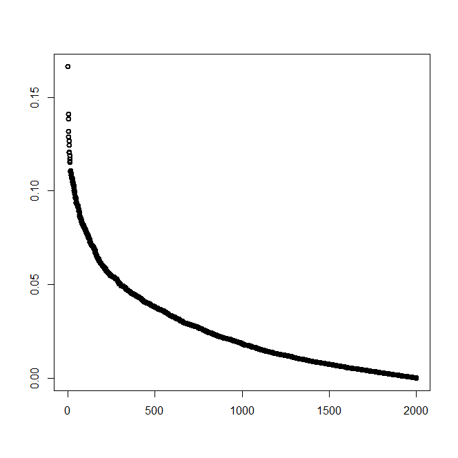
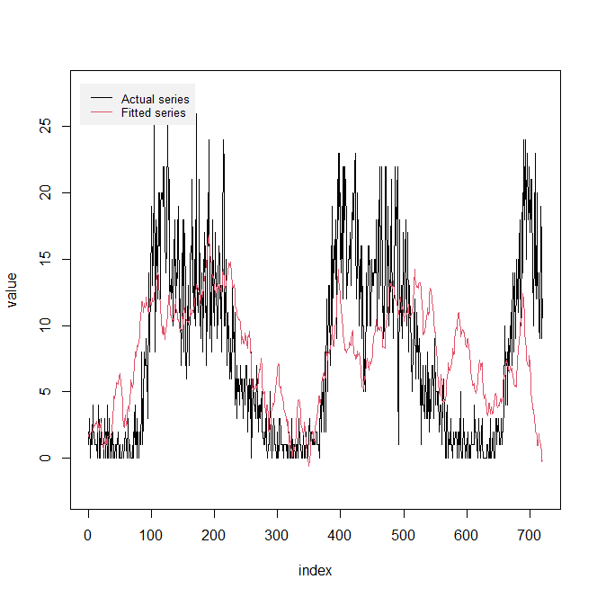

# Quantum Walk-Based Data Analysis and Prediction

This project uses quantum walks to analyze and predict graph-structured data. The model applies quantum walk simulations to understand and forecast data patterns in graph-based structures.

## Table of Contents

- [Installation](#installation)
- [Usage](#usage)
- [Project Structure](#project-structure)
- [Contributing](#contributing)
- [License](#license)
- [Acknowledgements](#acknowledgements)

## Installation

### Requirements

1. Clone the repository:
   ```bash
   git clone https://github.com/your-username/quantum-walk-traffic-flow.git
   ```

2. Install the required R package:
   ```r
   install.packages("QWDAP")
   ```

3. Make sure your input data and other files are placed in the correct directories as outlined below.

## Test example

```r
library(QWDAP)

# Read the traffic flow data
trafficflow <- read.csv("test data/Ori_5min_new.csv", header = TRUE)

# Get the time series length (number of rows) and the number of nodes (columns)
time_length <- nrow(trafficflow)  # Time series length
node_count <- ncol(trafficflow)   # Number of nodes

# Create the adjacency matrix (assuming it's a graph with 7 nodes, but you can modify this based on your network structure)
edges <- matrix(c(0,1,0,0,0,0,0,
                  1,0,1,0,0,0,0,
                  0,1,0,1,0,0,0,
                  0,0,1,0,1,0,0,
                  0,0,0,1,0,1,0,
                  0,0,0,0,1,0,1,
                  0,0,0,0,0,1,0),
                nrow = 7)

# Run the quantum walk simulation
res.qwalk <- qwdap.qwalk(edges, startindex = 1, lens = time_length, scals = seq(from = 0.01, by = 0.01, length.out = 2000))  # 'lens' is the time series length, 'scal' starts from 'from', increments by 'by', generating 'length.out' modes
# Set dimension names for the quantum walk result
dims <- dim(res.qwalk$ctqw)
dimnames(res.qwalk$ctqw) <- list(
  1:dims[1],                  # Time series length
  paste0("Node", 1:dims[2]),  # Number of nodes
  paste0("Mode", 1:dims[3])   # Number of mode scales
)

# Create an empty data frame to store the predictions for all nodes
all_predictions <- data.frame(matrix(ncol = node_count, nrow = time_length))  # 'time_length' rows (prediction length), 'node_count' columns (number of nodes)

# Set the column names of predictions to match the input data
colnames(all_predictions) <- colnames(trafficflow)

# Loop through all nodes for simulation and prediction
for (node_id in 1:dims[2]) {
  # Perform rrelieff modeling for each node
  res.rrelieff <- qwdap.rrelieff(trafficflow, res.qwalk, index = node_id, num = 30, TRUE)  # 'index' is the node index, 'num' is the number of selected mode scales
  
  # Perform SWR simulation for each node
  res.swr <- qwdap.swr(res.rrelieff, data_range = c(1, time_length), TRUE)  # 'data_range' is the simulation time range, based on the data length
  
  # Make predictions for each node
  res.predict <- qwdap.predict(res.swr, data_range = c(1, time_length))  # 'data_range' specifies the time range for simulation and prediction
  
  # Store the prediction results into the all_predictions data frame
  all_predictions[, node_id] <- res.predict
}

# Output the predictions for all nodes
print(all_predictions)

# If needed, export the results to a CSV file
write.csv(all_predictions, "predictions_all_nodes.csv", row.names = FALSE)
```

## Test result Visualization

<p align="center">
  
  <br>
  <em>Modes selection by rrelieff</em>
</p>

<p align="center">
  
  <br>
  <em>Traffic flow simulated by QWDAP</em>
</p>

This is an example of a quantum walk simulation result.

## Project Structure

The project folder is organized as follows:

```

/Quantum Walk-Based Data Analysis and Prediction
├── Module
│   └── [Running code]                   # Folder containing all the code necessary for running simulations and predictions
├── Visualization
│   └── [Result data & visualization code] # Folder containing the result data and the code for visualizing results
├── Raw data
│   └── [Original data]                  # Folder containing raw data files for analysis
├── test
│   └── [Example data & code]            # Folder containing example data and code for testing
```

- **Module**: Contains the main code for running the quantum walk analysis.
- **Visualization**: Contains the result data and the corresponding code for visualizing the analysis output.
- **Raw data**: Contains the original data files used for the analysis.
- **test**: Includes example data and code for running the example use cases.

## Contributing

We welcome contributions! To contribute:

1. Fork the repository.
2. Create a new branch (`git checkout -b feature-branch`).
3. Commit your changes (`git commit -am 'Add new feature'`).
4. Push to the branch (`git push origin feature-branch`).
5. Create a Pull Request describing your changes.

## License

This project is licensed under the MIT License - see the [LICENSE.md](LICENSE.md) file for details.

## Acknowledgements

- QWDAP package for quantum walk simulations.  https://github.com/cran/QWDAP
